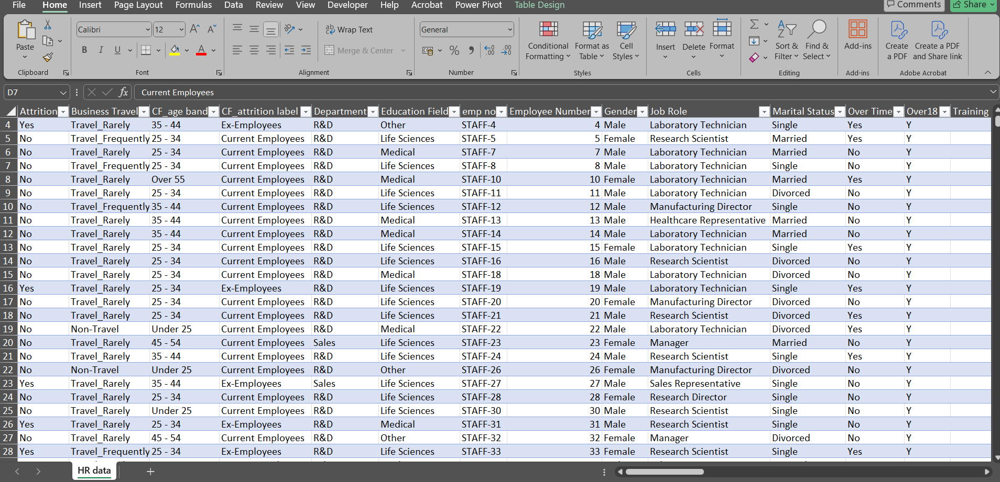
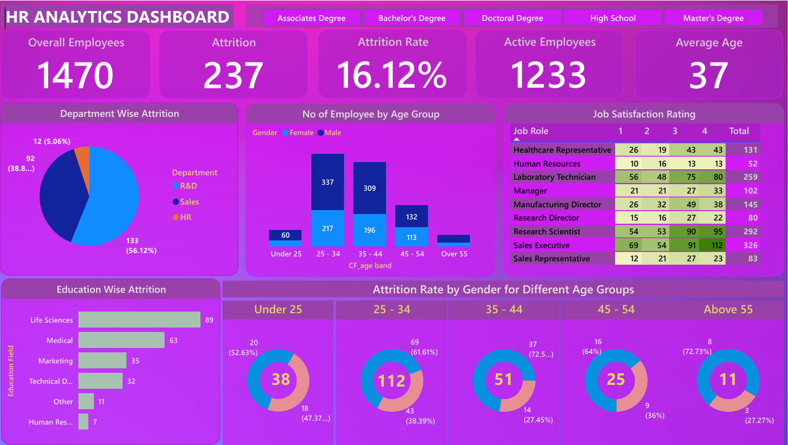

# HR Data Analysis

## Description:
This project involves analyzing HR data using Power BI to uncover key insights related to employee attrition, performance, demographics, and organizational trends.

## Tool:
- Power BI

## Project Type:
Data Visualization, Business Intelligence, Data Analysis

## Data Set Link:

[HR Data.xlsx](./HR%20Data.xlsx)

## Project File Link:
[HR_Data_Analysis.pbix](./HR_Data_Analysis.pbix)

---

## Summary

### Goal:
To provide actionable insights into employee data, focusing on key metrics such as attrition rates, performance, and demographics, aiding in strategic decision-making for HR management.

### Process:
1. **Data Preparation**:
   - Imported the dataset from `HR Data.xlsx` into Power BI.
   - Performed data cleaning and transformation to handle missing or inconsistent values.
2. **Visualization Development**:
   - Designed interactive dashboards showcasing:
     - Employee attrition rates by department and tenure.
     - Demographics breakdown (e.g., age, gender, and education levels).
     - Key performance indicators (KPIs) such as satisfaction scores and salary trends.
     - Employee retention analysis.
3. **Insights**:
   - Created visualizations to explore patterns in attrition and performance metrics.
   - Enabled filtering by attributes like department, job role, and tenure.

### Insights:
- **Attrition Analysis**:
  - High attrition observed in specific job roles and departments.
  - Attrition correlated with low job satisfaction and salary levels.
    
- **Demographic Insights**:
  - Majority of employees fall within the 25-35 age range.
  - Gender representation varied across departments.

- **Performance Trends**:
  - Employees with higher satisfaction scores tend to perform better and have lower attrition rates.

