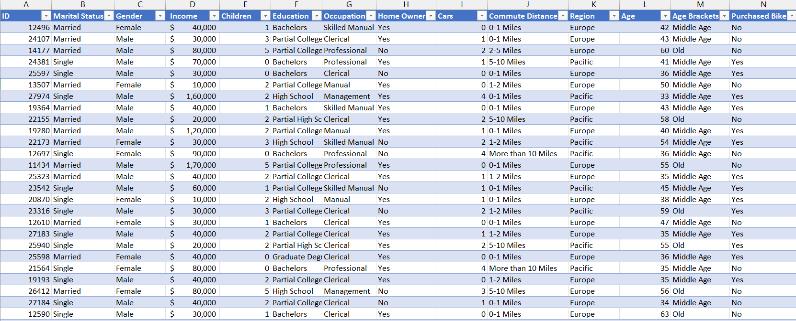
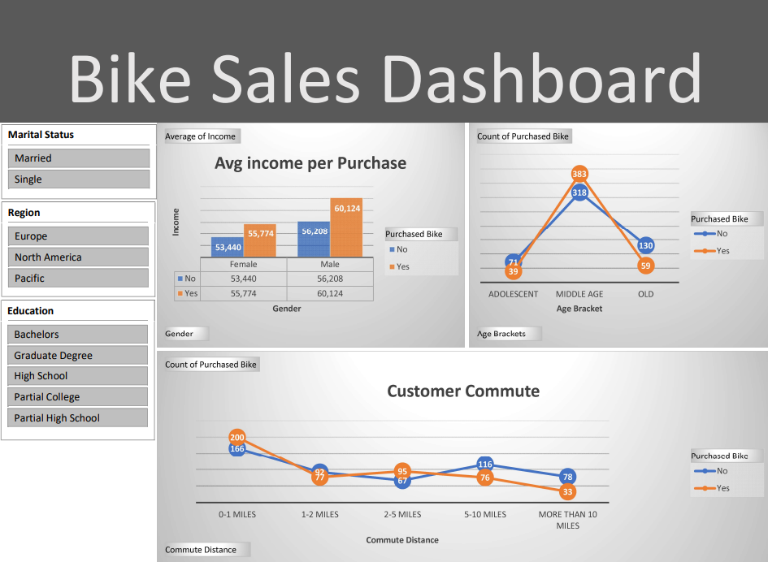

# Bike Buyers Dataset Analysis

## Description:
An analysis of the Bike Buyers dataset to understand customer purchasing behavior based on demographics, income levels, commute distance, and other factors.

## Tool:
- Excel for data visualization and summary statistics.
- PDF report for finalized visualizations and insights.

## Project Type:
Data Visualization, Data Analysis

## Data Set Link:
[Download Bike Buyers Dataset](Bike_Buyers_Dataset.xlsx)

## Project File Link:
[Download Bike Buyers Project](Bike_Buyers_Dataset.xlsx)

---

## Summary

### Goal
To analyze the factors influencing bike purchase decisions and create visualizations to highlight key insights.

### Process
1. **Data Cleaning**: Prepared the dataset by checking for missing values and standardizing formats.
2. **Data Visualization**: Created charts and graphs to showcase trends, including:
   - Bike purchases segmented by gender.
   - Average income per purchase decision.
   - Commute distance analysis.
   - Age bracket purchase trends.

3. **Data Analysis**: Derived insights using summarized statistics and visual trends.

### Insights
- **Gender and Purchase Decision**: 
  - More males (60,124) purchased bikes compared to females (55,774).
  - Non-buyers were relatively balanced across genders.

- **Income**:
  - There is a correlation between higher income and bike purchases.

- **Commute Distance**:
  - The most common commute distance among buyers was 2-5 miles.
  - Long-distance commuters (>10 miles) were less likely to purchase bikes.

- **Age Bracket**:
  - Middle-aged individuals showed the highest bike purchase rate.

