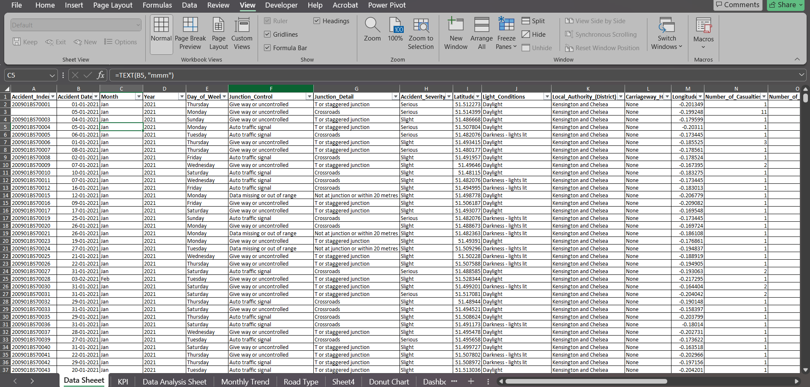
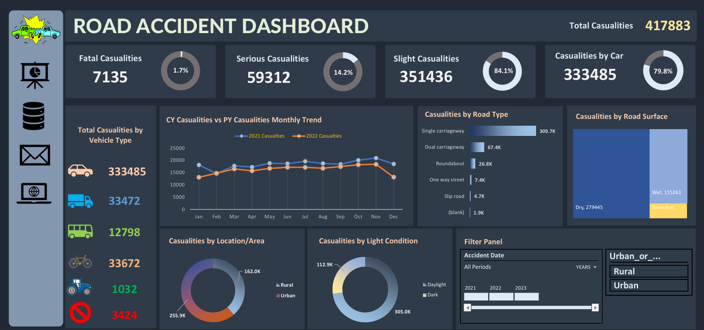

# Road Accident Data Analysis

## Description:
This project involves analyzing road accident data to uncover trends and insights related to casualties based on various factors like vehicle type, road type, surface conditions, and light conditions.

## Tool:
Excel (Data Cleaning, Analysis, and Visualization)

## Project Type:
Data Cleaning, Data Analysis, Data Visualization

## Data Set Link:

## Project File Link:
[Road Accident Data Analysis](Road_Accident_Analysis.pdf)

---

## Summary

- **Goal**  
  Analyzing and visualizing road accident data to identify critical patterns and provide actionable insights for road safety improvements.

- **Process**  
  1. Data Cleaning: Addressed missing values, standardized categories, and removed irrelevant data.  
  2. Data Analysis: Aggregated casualties by year, vehicle type, and road conditions.  
  3. Visualization: Created dashboards to showcase trends such as casualties by area type, road surface conditions, and yearly/monthly patterns.

- **Insights**  
  - Most casualties occur on single-carriageways and during daylight conditions.  
  - Urban areas account for the majority of accidents compared to rural areas.  
  - The highest number of casualties were recorded for cars, emphasizing a need for stricter safety regulations for car drivers.  

---

## Key Visualizations

### Total Casualties Overview  
### Casualties by Vehicle Type  
### Monthly Casualty Trends (Year Comparison)  
### Casualties by Road Surface and Light Conditions  

