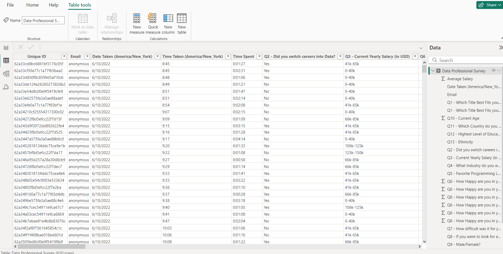
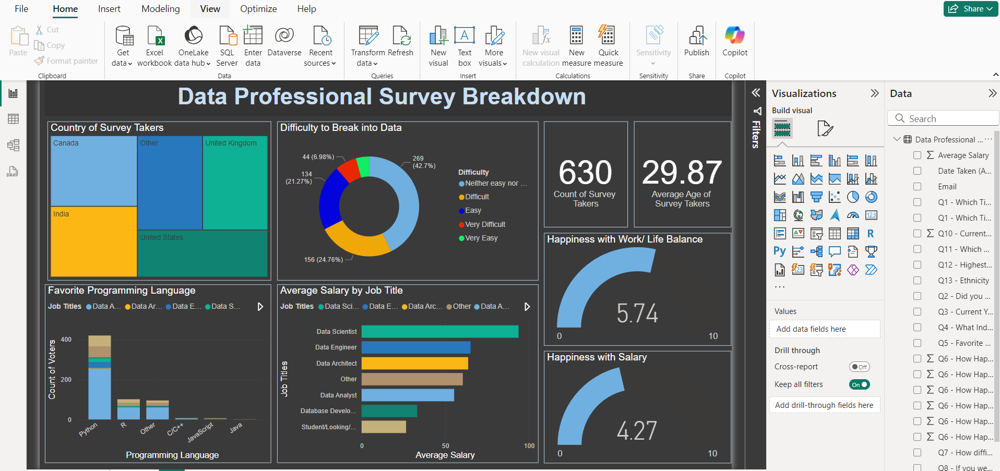
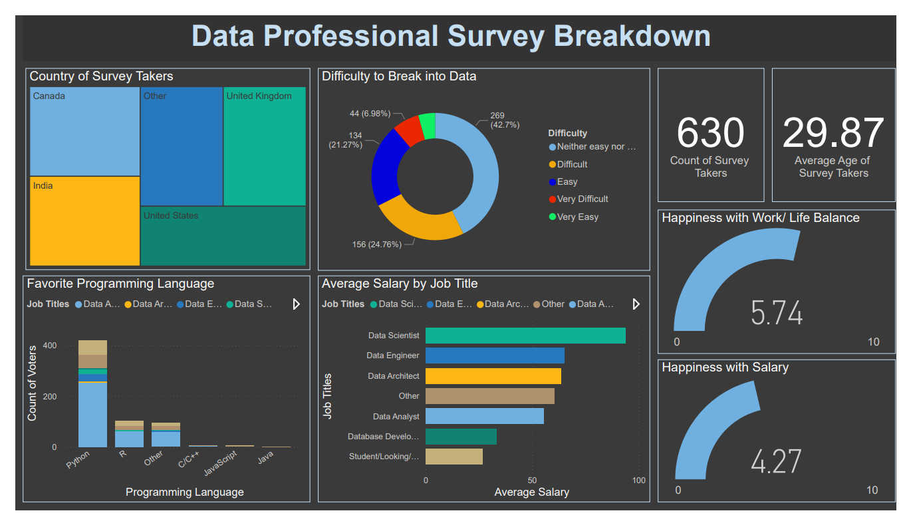

# Data Professional Survey Analysis

## Description
An analysis of survey data from data professionals to explore career satisfaction, salary trends, programming language preferences, and demographic insights.

## Tool
- **Power BI** (for data visualization)
- **Excel** (for data cleaning and transformation)

## Project Type
- Data Visualization
- Data Analysis
- Data Cleaning

## Data Set Link

[Download Excel Data](./Data_Professional_Survey_Data-Excel.xlsx)

## Project File Link

- [Power BI Report](./Data_Professional_Survey_Data-powerbi.pbix)

---

## Summary

### Goal
To provide actionable insights into the career paths, preferences, and satisfaction levels of data professionals.

### Process
1. **Data Cleaning**:
   - Removed null columns (e.g., `Browser`, `OS`, `City`).
   - Verified data types for analysis.
2. **Analysis**:
   - Explored salary trends and satisfaction ratings.
   - Assessed popular programming languages and career transition patterns.
3. **Visualization**:
   - Created interactive dashboards in Power BI for a holistic view of the dataset.

### Insights
- **Salaries**: A significant portion of respondents earn between $60,000–$100,000 annually.
- **Programming Languages**: Python is the most preferred language among data professionals.
- **Career Transition**: About 40% of respondents switched careers into data-related fields.
- **Job Satisfaction**:
  - Work-life balance and learning opportunities ranked highest for job satisfaction.
  - Management satisfaction showed varied responses across age groups.

---

## Visuals
1. **Salary Distribution Chart**
2. **Programming Language Preference**
3. **Job Satisfaction Breakdown**
   

