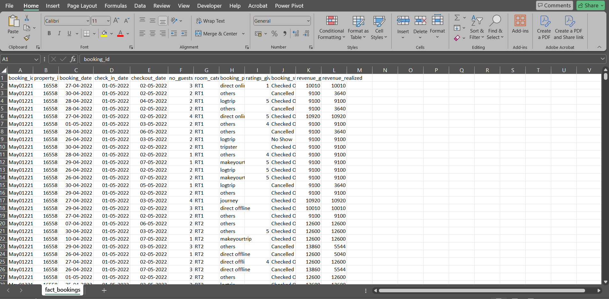
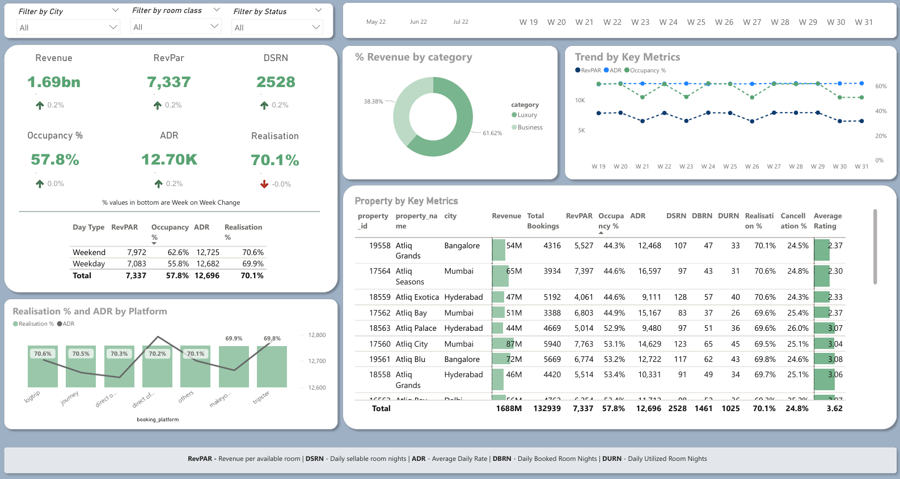

# Revenue Insights in Hospitality Domain

## Description:
This project analyzes the revenue trends in the hospitality industry using data from the **fact_bookings.csv** dataset and other supporting sheets. Key metrics such as revenue, booking trends, and performance by region are visualized and explored.

## Tool:
Power BI

## Project Type:
Data Cleaning, Data Analysis, Data Visualization

## Data Set Link:

[fact_bookings.csv](fact_bookings.csv)
[dim_date.csv](dim_date.csv)
[dim_hotels.csv](dim_hotels.csv)
[dim_rooms.csv](dim_rooms.csv)
[fact_aggregated_bookings.csv](fact_aggregated_bookings.csv)

## Project File Link:
[Revenue Insights in Hospitality Domain](Revenue_Insights_in_Hospitality_Domain-powerbi.pbix)

---

## Summary

- **Goal**  
  To provide actionable insights into the hospitality domain by analyzing booking data and identifying trends and patterns to improve revenue strategies.

- **Process**  
  1. Imported and cleaned the **fact_bookings.csv** dataset.  
  2. Modeled the data to establish relationships between key entities such as regions, booking types, and revenue.  
  3. Created interactive Power BI dashboards to showcase insights such as revenue trends, top-performing regions, and customer preferences.

- **Insights**  
  - The majority of revenue is generated during peak holiday seasons.  
  - Regions with the highest revenue have a strong correlation with promotional activities.  
  - Direct bookings outperform other channels in generating higher revenue margins.  
  - Cancellation rates significantly affect overall revenue in certain regions.  

---

## Key Visualizations
### Total Revenue Trends  
### Revenue by Region  
### Booking Trends and Channels  
### Cancellation Impact on Revenue 

