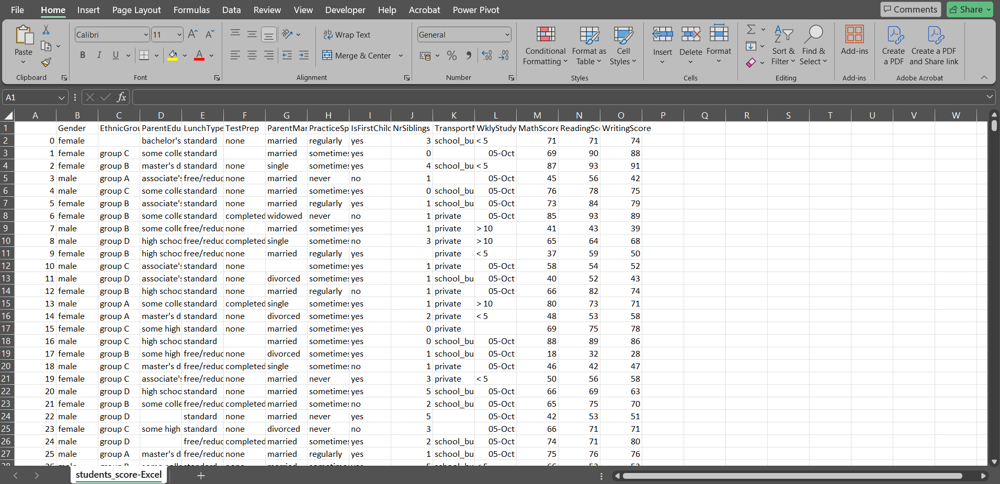

# Students' Performance Analysis

## Description:
This project analyzes student performance based on demographic, educational, and extracurricular factors. The dataset includes scores in math, reading, and writing and other related variables.

## Tool:
- Python (Pandas, Matplotlib, Seaborn)

## Project Type:
Data Cleaning, Data Visualization, Data Analysis

## Data Set Link:

[students_score-Excel.csv](./students_score-Excel.csv)

## Project File Link:
[students_score_analysis.ipynb](./students_score_analysis.ipynb)

---

## Summary

### Goal:
To analyze patterns and trends in student performance based on demographic and behavioral factors.

### Process:
1. **Data Cleaning**:
   - Removed irrelevant columns (e.g., `Unnamed: 0`).
   - Handled missing values in key fields like `EthnicGroup`, `ParentEduc`, etc.
2. **Exploratory Data Analysis (EDA)**:
   - Examined gender distribution (Visualized using a bar chart).
   - Analyzed correlations between test preparation and scores.
   - Assessed the impact of weekly study hours on performance.
3. **Insights Visualization**:
   - Created charts for gender-based performance, study time, and test preparation effects.

### Insights:
- **Gender Distribution**:
  - The dataset contains more female students than male students.
- **Impact of Test Preparation**:
  - Students who completed test preparation scored significantly higher.
- **Weekly Study Hours**:
  - Study hours correlate positively with scores in all subjects.

## Code
Below is an example of the Python code used in this project:

```python
import pandas as pd
import matplotlib.pyplot as plt
import seaborn as sns

# Load data
data = pd.read_csv("students_score-Excel.csv")

# Data Cleaning
data = data.drop(columns=['Unnamed: 0'])
data = data.dropna(subset=['EthnicGroup', 'ParentEduc', 'TestPrep'])

# Gender Distribution
gender_counts = data['Gender'].value_counts()
plt.figure(figsize=(8, 5))
sns.barplot(x=gender_counts.index, y=gender_counts.values, palette="viridis")
plt.title("Gender Distribution")
plt.xlabel("Gender")
plt.ylabel("Count")
plt.show()

# Test Preparation Impact
plt.figure(figsize=(8, 5))
sns.boxplot(x="TestPrep", y="MathScore", data=data, palette="coolwarm")
plt.title("Impact of Test Preparation on Math Scores")
plt.xlabel("Test Preparation")
plt.ylabel("Math Score")
plt.show()


