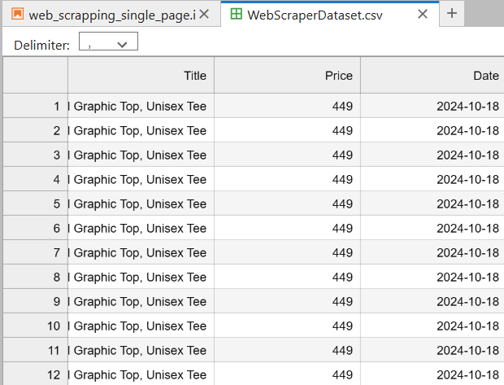

# Amazon Product Price Tracker

## Description:
This project involves building a web scraper to track the price of a specific Amazon product over time. The script periodically collects the product's title, price, and the date of collection, storing this information in a CSV file for later analysis.

## Tool:
- Python (`requests`, `BeautifulSoup`, `re`, `csv`, `pandas`)

## Project Type:
Web Scraping, Data Collection, Automation

## Data Set Link:


Generated CSV File: [WebScraperDataset.csv](./WebScraperDataset.csv)

## Project File Link:
[Amazon_Price_Tracker.py](./Amazon_Price_Tracker.py)

---

## Summary

### Goal:
To monitor and log the price of a specific Amazon product to analyze trends and determine the best time for purchase.

### Process:
1. **Data Collection**:
   - Scraped product information from the Amazon product page.
   - Extracted:
     - Product title
     - Product price
     - Date of data collection
2. **Data Storage**:
   - Logged the extracted data into a CSV file (`WebScraperDataset.csv`).
   - Updated the file periodically to capture changes in price.
3. **Automation**:
   - Automated the data collection process using a loop to run the scraper multiple times over a period.

### Insights:
- **Product Title**:
  - Captured from the product page dynamically.
- **Price Tracking**:
  - Logged price changes over time for analysis.
  - ![Insert screenshot of CSV data here]

---

## Code
Below is a snippet of the Python code used in the project:

```python
import requests
from bs4 import BeautifulSoup
import re
import csv
import datetime

# URL of the Amazon product
URL = "https://www.amazon.in/Seek-Buy-Love-Spreadsheet-Accountant/dp/B0CZJ82YT1"

# Set headers to mimic a browser
headers = {
    "User-Agent": "Mozilla/5.0 (Windows NT 10.0; Win64; x64) AppleWebKit/537.36 (KHTML, like Gecko) Chrome/128.0.0.0 Safari/537.36",
    "Accept-Encoding": "gzip, deflate",
    "DNT": "1",
    "Connection": "close",
}

# Scrape data
page = requests.get(URL, headers=headers)
soup = BeautifulSoup(page.content, "html.parser")

# Extract title and price
title = soup.find(id="title_feature_div").get_text(strip=True)
price = soup.find(id="corePriceDisplay_desktop_feature_div").get_text(strip=True)
cleaned_price = re.search(r"₹(\d+)", price).group(1)

# Log data into a CSV
today = datetime.date.today()
header = ["Title", "Price", "Date"]
data = [title, cleaned_price, today]

with open("WebScraperDataset.csv", "a+", newline="", encoding="UTF8") as f:
    writer = csv.writer(f)
    writer.writerow(data)

