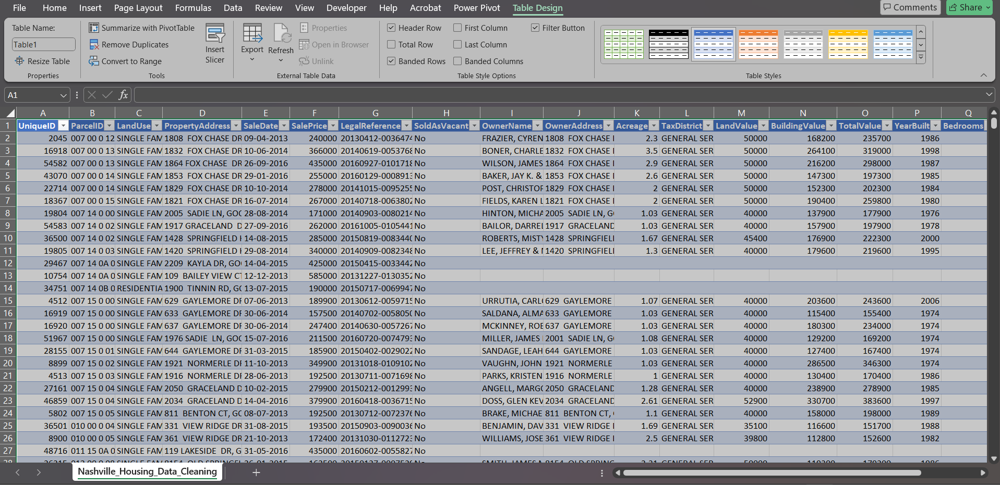
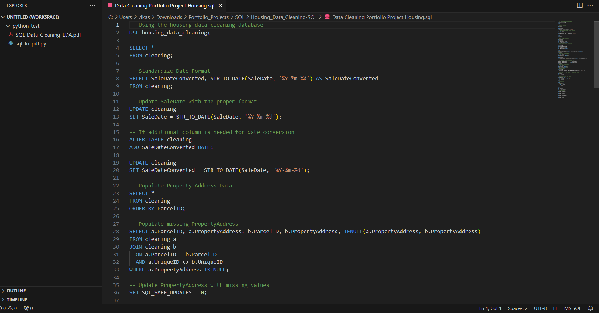

# Data Cleaning Portfolio Project - Housing

## Description:
A data cleaning project focusing on housing datasets to ensure consistency, completeness, and accuracy of property-related data.

## Tool:
- SQL for data cleaning and transformations.
- PDF report for summarized processes and key visuals.

## Project Type:
Data Cleaning, Data Transformation

## Data Set Link:

## Project File Link:

---

## Summary

### Goal
To clean and transform a housing dataset for downstream analysis and reporting.

### Process
1. **Standardizing Date Formats**:
   - Converted dates using `STR_TO_DATE` to a consistent format (`%Y-%m-%d`).

2. **Handling Missing Data**:
   - Populated missing property addresses by cross-referencing parcel IDs.

3. **Splitting Address Fields**:
   - Split property and owner addresses into separate columns for address, city, and state.

4. **Categorical Data Cleaning**:
   - Replaced 'Y' and 'N' with 'Yes' and 'No' in the "Sold as Vacant" column.

5. **Duplicate Removal**:
   - Used `ROW_NUMBER` in a CTE to identify and remove duplicate records.

6. **Schema Optimization**:
   - Dropped unused columns such as `OwnerAddress`, `TaxDistrict`, `PropertyAddress`, and `SaleDate`.

### Insights
- Address normalization allows for easier geospatial analysis and aggregation.
- Cleaning categorical fields ensures consistency in reporting.
- Schema optimization reduces storage and enhances query performance.

