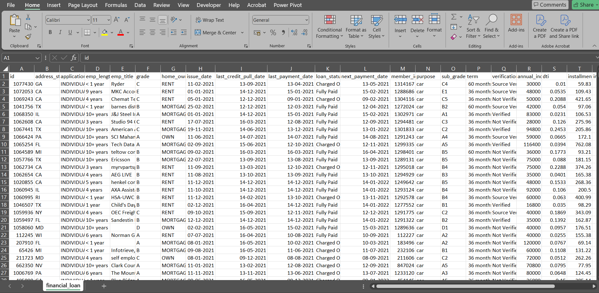
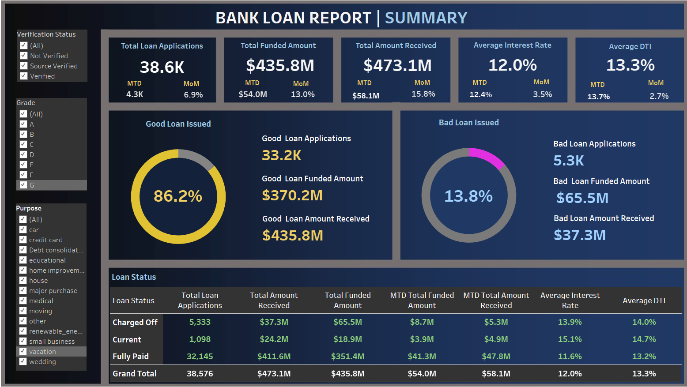

# Bank Loan Analysis

## Description
This project analyzes a financial loans dataset to uncover insights about loan performance, borrower characteristics, and trends in loan applications. It leverages Tableau for data visualization and summary statistics.

## Tool
- Tableau (Visualization)
- Python (Data Cleaning and Analysis)

## Project Type
Data Visualization, Data Analysis, Data Modeling

## Data Set Link

[Download financial_loan.csv](./financial_loan.csv)

## Project File Link
[Download Bank_loan_Report.twb](./Bank_loan_Report.twb)

---

## Summary

### Goal
- Understand the characteristics of good and bad loans.
- Identify trends in interest rates, debt-to-income ratios (DTI), and loan applications over time.
- Provide actionable insights for financial decision-making.

### Process
1. **Data Preparation**: Loaded and cleaned data for analysis. Key fields include `loan_status`, `loan_amount`, `int_rate`, and `annual_income`.
2. **Visualization**: Used Tableau to create dashboards focusing on:
   - Monthly trends in applications, funded amounts, and interest rates.
   - Comparative analysis of good vs. bad loans.
   - Loan performance metrics such as total amount received.
3. **Analysis**:
   - Correlation between `int_rate` and `loan_status`.
   - Distribution of loan amounts by borrower characteristics like `home_ownership` and `emp_length`.
   - Monthly and yearly trends in DTI and loan applications.

### Insights
- **Loan Status Distribution**: The majority of loans are in good standing, but a significant portion of funds are tied to bad loans.
- **Borrower Trends**:
  - Borrowers with higher DTI and lower annual incomes are more likely to default.
  - Homeownership positively correlates with better loan performance.
- **Trends**:
  - Interest rates have shown a slight upward trend month-over-month.
  - Applications peak seasonally, with higher volumes in Q4.
- **Good vs. Bad Loans**:
  - Good loans have lower interest rates and higher funded amounts.
  - Bad loans are concentrated among borrowers with lower credit grades (`D` and below).

