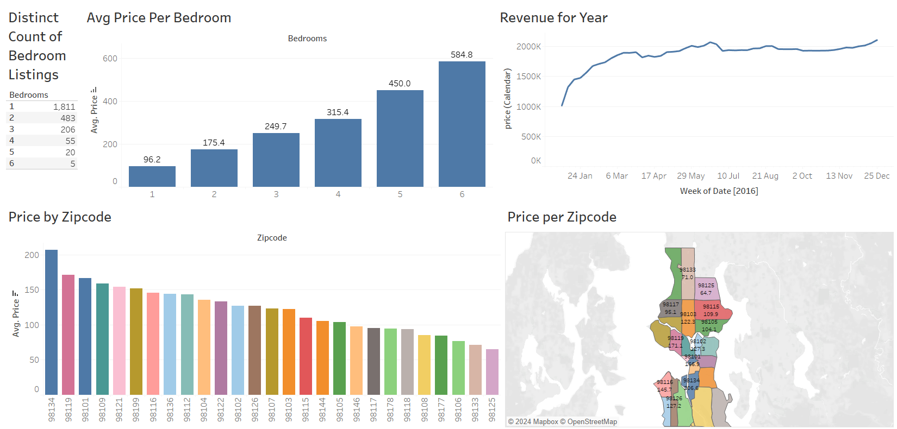

# House Listings Analysis

## Description:
This project analyzes Airbnb listings, customer reviews, and calendar data to provide insights into property availability, pricing, and customer sentiments.

## Tool:
- Tableau (for visualizations)
- Excel (for data storage and analysis)

## Project Type:
Data Visualization, Data Analysis

## Data Set Link:

## Project File Link:
[House_Listings.twb](./House_Listings.twb)

---

## Summary

### - Goal:
The objective of this project is to:
1. Explore the key attributes of Airbnb listings, such as pricing, location, and availability.
2. Analyze customer reviews to identify sentiment and feedback trends.
3. Examine pricing and availability patterns over time.

### - Process:
1. **Data Cleaning**:
   - Removed missing or inconsistent entries from the dataset.
   - Ensured consistency in date formats and numeric fields.

2. **Data Exploration**:
   - Examined listings to extract details like price range, descriptions, and neighborhood summaries.
   - Analyzed customer reviews to understand the sentiment and recurring themes.
   - Reviewed calendar data to determine booking trends and availability.

3. **Visualization**:
   - Created dashboards in Tableau to visualize trends such as:
     - Price distribution.
     - Review sentiment across properties.
     - Seasonal availability and pricing.

### - Insights:
1. **Listings**:
   - On average, properties are priced between $50 and $300 per night.
   - Neighborhoods like Queen Anne have high customer ratings and demand.

2. **Reviews**:
   - Positive sentiments dominate, with frequent mentions of location and cleanliness.
   - Most complaints are about high prices and booking difficulties.

3. **Calendar**:
   - Peak demand occurs during summer months.
   - Properties are generally unavailable during major holidays.

---

